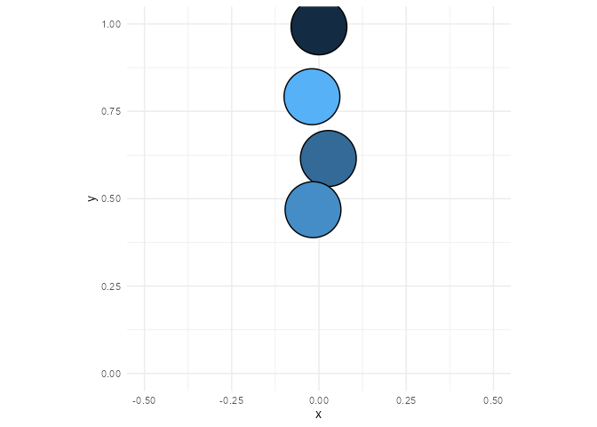

<!-- README.md is generated from README.Rmd. Please edit that file -->

# Rapier 2D for R

<!-- badges: start -->
<!-- badges: end -->

## What is Rapier?

[Rapier](https://github.com/dimforge/rapier) is the 2D and 3D physics
engines for the Rust programming language.

## Installation

You can install the development version of rpr2dr like so:

``` r
# FILL THIS IN! HOW CAN PEOPLE INSTALL YOUR DEV PACKAGE?
```

## Example

``` r
library(rpr2dr)
library(ggplot2)

d <- bouncing_ball()

p <- ggplot() +
  ggforce::geom_circle(aes(x0 = x, y0 = y, r = 0.05, fill = index)) +
  scale_size_identity() +
  theme_minimal() +
  theme(legend.position = "none") +
  coord_equal(xlim = c(-0.5, 0.5), ylim = c(0, 1))

for (i in seq_len(nrow(d))) {
  plot(p %+% dplyr::filter(d, frame == {{ i }}))
}
```


