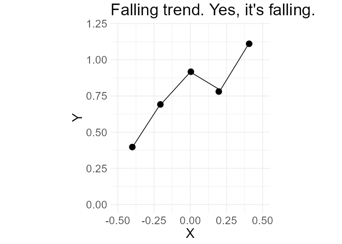

<!-- README.md is generated from README.Rmd. Please edit that file -->

# rapierr

Bring Rapier 2D functionality to R

<!-- badges: start -->
<!-- badges: end -->

:warning: :warning: :warning: :warning: :warning: :warning: :warning:
:warning: :warning: :warning:

Don’t expect this package to work at the moment.

:warning: :warning: :warning: :warning: :warning: :warning: :warning:
:warning: :warning: :warning:

## What is Rapier?

[Rapier](https://github.com/dimforge/rapier) is the 2D and 3D physics
engines for the Rust programming language.

## Installation

You can install the development version of rapierr like so:

``` r
remotes::install_github("yutannihilation/rapierr")
```

## Example

``` r
library(rapierr)
library(ggplot2)

world <- Rapier2DWorld$new()

# ground
world$add_fixed_segment(-50.0, 0.0, 50.0, 0.0, 0.70);
#> Isometry { rotation: Complex { re: 1.0, im: 0.0 }, translation: [0.0, 0.0] }

world$add_line(-0.2, 0.7, 0.2, 0.7, 0.7);

world$add_ball( 0.1, 0.9, 0.08, 0.97)
world$add_ball(-0.1, 0.4, 0.08, 0.97)

d1 <- world$step(30)

# Add more balls
world$add_ball( 0.0, 1.0, 0.08, 0.97)
world$add_ball(-0.2, 0.9, 0.08, 0.97)

d2 <- world$step(120)

d <- dplyr::bind_rows(d1, d2)
d$index <- factor(d$index)

p <- ggplot() +
  ggforce::geom_circle(data = \(x) dplyr::filter(x, index != 0L),
                       aes(x0 = x, y0 = y, r = 0.08, fill = index)) +
  geom_segment(data = \(x) dplyr::filter(x, index == 0L),
               aes(x    = x - 0.4 * cos(angle),
                   y    = y - 0.4 * sin(angle),
                   xend = x + 0.4 * cos(angle),
                   yend = y + 0.4 * sin(angle))) +
  scale_size_identity() +
  coord_equal(xlim = c(-0.5, 0.5), ylim = c(0, 1)) +
  scale_fill_viridis_d(NULL, option = "F", drop = FALSE) +
  ggtitle("Physiiiiics!!!!") +
  theme_minimal() +
  theme(text = element_text(size = 20))

for (frame in seq_len(max(d$frame))) {
  plot(p %+% dplyr::filter(d, frame == {{ frame }}))
}
```



## Similar Projects

- [chipmunkcore](https://github.com/coolbutuseless/chipmunkcore)
